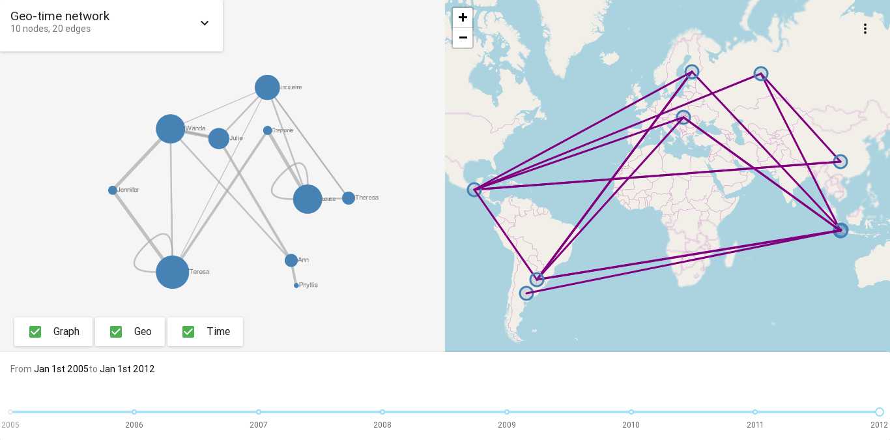

# Topogram

**Topogram** is a web-based app to visualize the evolution of networks over time and space.

[](https://travis-ci.org/topogram/topogram)

### Features

- Time-based navigation in graph
- Network layouts + geographic data
- Online/real-time data update via API


## Input data

Currently, the simplest way is to input data is to use the [Python API client](https://github.com/topogram/topogram-api-client) to push data directly into the database.


```python
from topogram-python-client import TopogramAPIClient

topogram = TopogramAPIClient("http://localhost:3000")

# create a new network
topogram.create_topogram("Awesome viz of geo-time network")

# add data
r = topogram.create_nodes(topogram_ID, [...nodes])
r = topogram.create_edges(topogram_ID, [...edges])

```

## Data format

### Nodes

You can add geographic and time information to the nodes.

| Name  | Type   |  | Description | Example |
|---    |---     |---  |--- |--- |
| id    | String | required | Id of the node. Should match node Id provided to the edges | 'My node 1' |
| name  | String | optional | The name of the node | 'Michael' |
| lat   | Float  | optional | Latitude (in degrees) | -6.7589 |
| lng   | Float  | optional | Longitude (in degrees)| 105.8671 |
| start | Date   | optional | Date when the node started existing | 2015 |
| end   | Date   | optional | Date when the node stopped existing | 2012 |
| color | String | optional | Color of the node | '#555000'|
| weight| Float  | optional | Weight of the node | 4 |
| group | String | optional | Some category to classify the node | 'male'|
| notes | String | optional | (Markdown) Additional info about the nodes | '# Title' |

See the model in [/imports/api/nodes/Nodes.js]()


Example of mapping using the Python API Client :

```python
  node = {
    "id" : str,
    "name" : str,
    "lat" : float,
    "lng" : float,
    "weight" : float,
    "start" : datetime,
    "end" : datetime,
    "notes" : str
    }
```

### Edges

Edges require a source and target. When source node or target node are absent from the data, the edge will be ignored.

| Name  | Type   |  | Description | Example |
|---      |---      |---  |---    |
| source  | String  | required  | Id of the source node (required) | 'My node 1' |
| target  | String  | required  | Id of the target node (required) | 'My node 2' |
| id      | String  | optional | Id of the edge | 'My edge 1' |
| name    | String  | optional | The name/label of the edge | 'Loves' |
| start | Date   | optional | Date when the edge started existing | 2015 |
| end   | Date   | optional | Date when the edge stopped existing | 2012 |
| color | String | optional | Color of the edge | '#555000'|
| weight| Float  | optional | Weight of the edge | 4 |
| group | String | optional | Some category to classify the edge | 'male'|
| notes | String | optional | (Markdown) Additional info about the edge | '# Title' |

See the model in [/imports/api/edges/Edges.js]()


Example of mapping using the Python API Client :

```python
  edge = {
    "source" : str,
    "target" : str,
    "weight" : float,
    "notes" : str
    }
```

## Visualization

Once you have created your topogram, it will be available at the list at the address [/topograms]() of your server. You can click on the title to access


### Panel Selector

The main visualization is divided between 3 panels :

* network graph
* geographical map
* timeline




You can toggle each of these panels by using the panel selector. When no geo or time element are detected, the checkboxes are disabled automatically.

### Side menu

By clicking on the title, you can access the main menu to manipulate and edit your topogram.

#### Map background

Change the tiles of the map according to your needs.

#### Network layout

Different layouts are available to display your graph. Try different options to see what fits you best.

#### Node Radius

Different options are available to display the nodes. It can used the degree of the node in the graph or a user-defined weight (if you assigned it in the data).

### Selection mode

When the selection mode is activated, you can click to highlight specific elements of the graphs.


## Download & Install

You need [Meteor JS](https://www.meteor.com/) to install Topogram.

    git clone https://github.com/topogram/topogram-client.git
    cd topogram-client
    meteor npm install
    meteor
